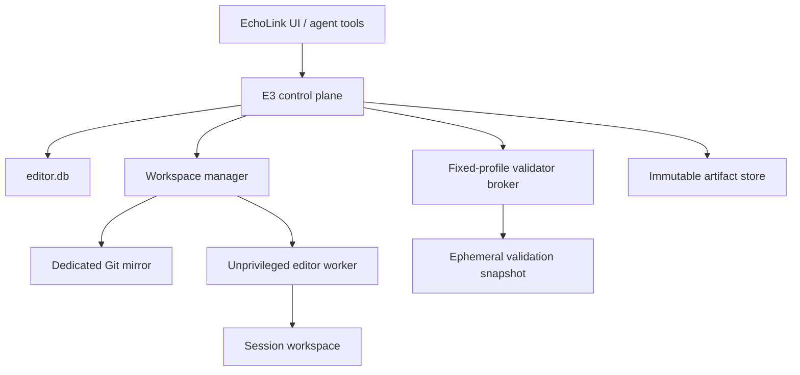

# EchoLink Editor Engine (E3)

## Architecture baseline

**Status:** accepted for E3 V1

**Decision date:** 2026-07-27

**Source baseline:** `4511411b8e60cc20be2ee5fdfad3a76f17e74a8e`

This directory is the normative architecture baseline for E3. It turns the
external `EchoLink_E3_Masterplan.md` and the step-0 audit into repository-local
decisions. An accepted ADR authorizes later implementation planning; it does
not by itself authorize a server, user, container, database, apply, deploy, or
other runtime change.

## Implementation progress

| Step | Source baseline | Result |
|---|---|---|
| 1 – ADR package | `4511411b8e60cc20be2ee5fdfad3a76f17e74a8e` | accepted architecture and threat model |
| 2 – Core contracts | `175fddb628ff2fbfc6f5f3842226fbf078567f92` | pure session contracts and state machine |
| 3 – Persistence | `61a301c851e55cd1bd22cda6e68477b8c84acf3b` | isolated SQLite schema, migrations, repository, events, leases, and idempotency |
| 4 – Read-only workspaces | `e6b474eac35e0a6a2f51545e908e767e6e4f901c` | dedicated bare mirror, exact detached worktrees, manifests, fenced lifecycle, and safe cleanup |

Step 2 lives in `server/e3/core/`. It defines the complete V1 and reserved
status sets, commands, event and failure codes, immutable session
construction, guarded transitions, version and fencing checks, frozen
candidate hashes, approval binding, invalidation, recovery targets, and
export completion evidence.

The Step-2 module has no filesystem, database, network, process, workspace,
shell, route, or UI integration. Reserved productive apply and revert
commands fail closed in V1.

Step 3 lives in `server/e3/persistence/`. It defines an isolated `editor.db`
with immutable checksummed migrations, verified WAL/foreign-key/durability
pragmas, startup `quick_check`, optimistic versions, append-only events,
request-ID replay, operation journaling, artifact and validation metadata,
and fenced leases. Session transitions, events, operation records,
candidate invalidation, and idempotency results use SQLite transactions.

No Step-3 module is imported by the application server or worker. Merely
starting or deploying EchoLink therefore does not create `editor.db`, change
the existing application database, expose a route, start a process, or enable
productive apply. Artifact byte publication, workspace access, validation,
and runtime wiring remain later gated steps.

Step 4 lives in `server/e3/workspaces/` and adds migration 002 for workspace
metadata. The manager accepts only a full commit reachable from the trusted
local `main`, fetches it into a credential-free dedicated bare mirror, and
creates a detached worktree below a canonical session UUID. A manager-owned,
hash-bound manifest records identity, fencing, age, logical size, entries,
symlinks, and the absence of workers, processes, containers, and ports.

Creation, inspection, and removal require the current workspace lease and
fencing token. Atomic lock files serialize mirror and workspace lifecycle.
Cleanup is limited to the exact registered worktree and empty manager-owned
directories; it rejects path, manifest, mirror, symlink, and lease tampering.
The manager never follows workspace symlinks and never recursively deletes a
derived path.

`E3_WORKSPACE_ENABLED` defaults to off. No Step-4 module is imported by the
application server or worker, no route or editor operation is exposed, and no
workspace, Git process, database migration, or cleanup runs during normal
EchoLink startup or deploy. The production repository remains a read-only
local fetch source and is covered by byte/status invariance tests.

## V1 objective

E3 V1 creates an isolated edit session from an exact Git commit, permits only
deterministic editor operations, freezes and validates the resulting patch,
records an auditable approval, and exports a reproducible patch package.

E3 V1 does not write to the production repository. Productive apply, deploy,
PM2 control, Git push, and automated post-apply undo remain disabled.

## Architecture at a glance

The existing root-owned EchoLink process may orchestrate E3, but it must not
become a free-form file or shell execution path. The editor worker owns only
its assigned workspace. It receives no production secrets, Docker socket,
Docker group membership, PM2 control, deploy rights, push credentials, or
write access to `/root/echolink`.

## Decision index

| ADR | Decision | Status |
|---|---|---|
| [ADR-001](adr/001-trust-boundaries.md) | Trust boundaries and process identities | accepted |
| [ADR-002](adr/002-workspaces.md) | Mirror, worktree, and workspace model | accepted |
| [ADR-003](adr/003-session-state.md) | Session state machine and invariants | accepted |
| [ADR-004](adr/004-persistence-artifacts.md) | Metadata database and artifacts | accepted |
| [ADR-005](adr/005-file-operations.md) | File operations and path safety | accepted |
| [ADR-006](adr/006-validation-sandbox.md) | Validation broker, containers, and network | accepted |
| [ADR-007](adr/007-apply-undo.md) | Review, approval, export, apply, and undo | accepted |
| [ADR-008](adr/008-recovery-retention-monitoring.md) | Recovery, reaper, quotas, and monitoring | accepted |

`Accepted` means the decision is the default for V1. A later incompatible
change requires a superseding ADR. Features explicitly marked `deferred`
remain outside the implementation scope until their own security gate passes.

## Binding invariants

1. The edit and validation workers cannot write to `/root/echolink`.
2. Every session is bound to one full base commit SHA.
3. Mutations occur only through registered, schema-validated E3 operations.
4. Agent-provided shell commands are never executed.
5. Paths are relative, normalized, contained, and checked without following
   symlinks.
6. `.git`, production `.env`, secrets, databases, backups, uploads,
   dependencies, and generated output are forbidden mutation targets.
7. Validation receives an environment allowlist without production secrets.
8. Database tests use newly created synthetic data only.
9. Test servers never bind the production port.
10. UI validation can reach only its isolated test application.
11. Approval binds the base SHA, patch SHA-256, validation-manifest SHA-256,
    and policy/profile versions.
12. Any mutation after review freeze invalidates validation and approval.
13. Session, workspace, mirror, apply, cleanup, and port concurrency is
    controlled by leases plus fencing tokens.
14. Every policy or validation error fails closed.
15. V1 does not push, deploy, restart PM2, or productively apply.
16. Logs are structured, redacted, bounded, and stored as hashed artifacts.
17. Completion requires durable artifacts, a final event, and confirmed
    workspace cleanup or quarantine.

The [threat model](threat-model.md) maps every invariant to an enforcement
point and a planned negative test.

## Operational incident notes

These notes document failures in the existing EchoLink operational path. They
are non-normative for E3 and do not expand E3 V1 permissions:

- [2026-07-27: PM2 self-deploy runner orphan](incidents/2026-07-27-pm2-self-deploy-runner.md)

## Normative priorities

When documents disagree, use this order:

1. a newer accepted or superseding ADR
2. this architecture baseline
3. the threat model
4. the external E3 master plan
5. older planning notes

Security invariants always fail closed. An implementation cannot silently
weaken an invariant because a host feature is unavailable.

## Phase gates

| Phase | Permitted outcome | Gate |
|---|---|---|
| Step 1 | documentation only | all invariants mapped to enforcement and tests |
| Step 2 | pure state-machine code | no filesystem, shell, network, or database access |
| Steps 3–7 | metadata, read-only workspaces, deterministic edits, artifacts | negative path and concurrency tests pass |
| Steps 8–10 | isolated validation | broker and network isolation pass adversarial tests |
| Steps 11–14 | review and pilot export | approval hash binding and recovery pass fault injection |
| Step 15+ | guarded productive apply | separate explicit approval and operational readiness review |

## Implemented isolation milestones

- Step 2: pure session contracts and state machine.
- Step 3: isolated transactional persistence and fencing-aware repositories.
- Step 4: default-off read-only workspace manager for exact detached worktrees.
- Step 5: default-off, versioned text editor kernel with deterministic reads,
  exact mutations, atomic publication, preimage retention, lease guards, and
  traversal/symlink/hardlink defenses.
- Step 6: session-bound mutation orchestration with a durable operation-intent
  journal, fencing, idempotency, content-addressed preimages, quotas, and
  explicit crash recovery.
- Step 7: immutable candidate artifacts with a reproducible complete-tree
  manifest, forward and reverse binary-safe patches, unified diff, bounded
  diff stat, atomic metadata publication, and tamper detection.

Step 5 is a library boundary only. It is not imported by the existing server
or worker, has no route or tool exposure, cannot target `/root/echolink`, and
does not enable productive apply, deployment, process execution, or Git.

Step 6 does not claim a false ACID transaction across SQLite and the
filesystem. It persists `PREPARED`, publishes the guarded workspace mutation,
persists `PUBLISHED`, and records the operation, event, session version,
idempotency result, and `RECORDED` state in one SQLite transaction. Recovery
compares the bound preimage and postimage: it may execute an unchanged
preimage once, finalize an already visible postimage without replaying the
mutation, or fail closed as `RECOVERY_REQUIRED`.

Step 6 remains an internal library boundary with no production route, agent
tool, repository apply, deployment, process execution, or Git capability.

Step 7 freezes a candidate twice through a private alternate Git index and
accepts it only when both tree and artifact hashes agree. The real workspace
index remains untouched. Durable bytes are published before their five
artifact rows and candidate-set binding commit in one SQLite transaction.
Forward and reverse patches are both checked in tests against the exact base.
Artifact objects are immutable, content-addressed, size-bounded, fsynced, and
verified on every read.

This is the foundation for review and pre-apply undo; it still exposes no
runtime route or tool and cannot apply a patch to the production repository.

## Explicit non-goals for V1

- semantic or AST-based editing
- dependency installation inside a session
- arbitrary commands or arbitrary validator arguments
- access to production services or data from validation
- direct editing of generated assets or dependencies
- multi-agent concurrent mutation of one workspace
- automatic merge conflict resolution
- productive apply, deploy, push, PM2 restart, or hard reset
- automatic Docker pruning
- claiming crash-atomic multi-file production replacement

## Terminology

- **Control plane:** authenticated orchestration, policy, state, and audit.
- **Workspace manager:** trusted owner of mirror and worktree lifecycle.
- **Editor worker:** unprivileged process that performs registered operations
  in exactly one assigned workspace.
- **Validator broker:** minimal privileged launcher for fixed container
  profiles; it is not a general command runner.
- **Validation snapshot:** frozen copy of the approved candidate used for
  executing untrusted project code.
- **Artifact:** immutable, size-bounded bytes addressed by SHA-256.
- **Lease:** time-bounded ownership record.
- **Fencing token:** monotonically increasing token required for every later
  state-changing write.
