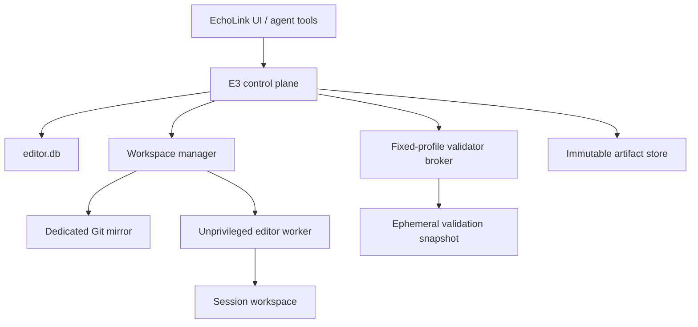

# EchoLink Editor Engine (E3)

## Architecture baseline

**Status:** accepted for E3 V1

**Decision date:** 2026-07-27

**Source baseline:** `4511411b8e60cc20be2ee5fdfad3a76f17e74a8e`

This directory is the normative architecture baseline for E3. It turns the
external `EchoLink_E3_Masterplan.md` and the step-0 audit into repository-local
decisions. An accepted ADR authorizes later implementation planning; it does
not by itself authorize a server, user, container, database, apply, deploy, or
other runtime change.

## Implementation progress

| Step | Source baseline | Result |
|---|---|---|
| 1 – ADR package | `4511411b8e60cc20be2ee5fdfad3a76f17e74a8e` | accepted architecture and threat model |
| 2 – Core contracts | `175fddb628ff2fbfc6f5f3842226fbf078567f92` | pure session contracts and state machine |
| 3 – Persistence | `61a301c851e55cd1bd22cda6e68477b8c84acf3b` | isolated SQLite schema, migrations, repository, events, leases, and idempotency |
| 4 – Read-only workspaces | `e6b474eac35e0a6a2f51545e908e767e6e4f901c` | dedicated bare mirror, exact detached worktrees, manifests, fenced lifecycle, and safe cleanup |
| 5 – Editor kernel | `eae9d3db41333a373e3b93876b60e26e084938e4` | deterministic guarded text operations |
| 6 – Mutation journal | `63a41acc3b9aed3b924b7992c252ab899f618760` | durable mutation intents and recovery |
| 7 – Candidate artifacts | `582dc42e11b3e8d2f4dd8a388f53199912ea3842` | immutable candidate, patch, diff, and manifest artifacts |
| 8 – Validation planning | `228caab3f3130eb68c6789b3c3031e6e6cb0bd55` | immutable profiles and sealed validation plans |
| 9 – Validation broker | `3e7a7d831d3906e36d3fa20cb75d33f71de26d7b` | isolated snapshots and hardened networkless runtime |
| 10 – UI validation | `c0eb2d77ed61d3718ee8bf08064f8e8c5e5abf9a` | isolated internal application/browser pair |
| 11 – Review gate | `39cc5d9e639b80543aa84bfca1f2bc934871fdc4` | immutable validation evidence and atomic review freeze |
| 12 – Bound approval | `260fb0e20f1e190f7cc91c5e2842938317685c3e` | immutable exact user consent and atomic approval transition |
| 13 – Pilot export | `fd7defec816d5e9d605579094d9b1795a2f620d3` | deterministic self-verifying manual patch package and atomic export transition |
| 14 – Recovery and reaper | `708a3e95f20b5895f9c198804b21e2d7b533b02f` | conservative reconciler, fenced cleanup, immutable decisions, and crash-resumable finalization |

Step 2 lives in `server/e3/core/`. It defines the complete V1 and reserved
status sets, commands, event and failure codes, immutable session
construction, guarded transitions, version and fencing checks, frozen
candidate hashes, approval binding, invalidation, recovery targets, and
export completion evidence.

The Step-2 module has no filesystem, database, network, process, workspace,
shell, route, or UI integration. Reserved productive apply and revert
commands fail closed in V1.

Step 3 lives in `server/e3/persistence/`. It defines an isolated `editor.db`
with immutable checksummed migrations, verified WAL/foreign-key/durability
pragmas, startup `quick_check`, optimistic versions, append-only events,
request-ID replay, operation journaling, artifact and validation metadata,
and fenced leases. Session transitions, events, operation records,
candidate invalidation, and idempotency results use SQLite transactions.

No Step-3 module is imported by the application server or worker. Merely
starting or deploying EchoLink therefore does not create `editor.db`, change
the existing application database, expose a route, start a process, or enable
productive apply. Artifact byte publication, workspace access, validation,
and runtime wiring remain later gated steps.

Step 4 lives in `server/e3/workspaces/` and adds migration 002 for workspace
metadata. The manager accepts only a full commit reachable from the trusted
local `main`, fetches it into a credential-free dedicated bare mirror, and
creates a detached worktree below a canonical session UUID. A manager-owned,
hash-bound manifest records identity, fencing, age, logical size, entries,
symlinks, and the absence of workers, processes, containers, and ports.

Creation, inspection, and removal require the current workspace lease and
fencing token. Atomic lock files serialize mirror and workspace lifecycle.
Cleanup is limited to the exact registered worktree and empty manager-owned
directories; it rejects path, manifest, mirror, symlink, and lease tampering.
The manager never follows workspace symlinks and never recursively deletes a
derived path.

`E3_WORKSPACE_ENABLED` defaults to off. No Step-4 module is imported by the
application server or worker, no route or editor operation is exposed, and no
workspace, Git process, database migration, or cleanup runs during normal
EchoLink startup or deploy. The production repository remains a read-only
local fetch source and is covered by byte/status invariance tests.

## V1 objective

E3 V1 creates an isolated edit session from an exact Git commit, permits only
deterministic editor operations, freezes and validates the resulting patch,
records an auditable approval, and exports a reproducible patch package.

E3 V1 does not write to the production repository. Productive apply, deploy,
PM2 control, Git push, and automated post-apply undo remain disabled.

## Architecture at a glance

The existing root-owned EchoLink process may orchestrate E3, but it must not
become a free-form file or shell execution path. The editor worker owns only
its assigned workspace. It receives no production secrets, Docker socket,
Docker group membership, PM2 control, deploy rights, push credentials, or
write access to `/root/echolink`.

## Decision index

| ADR | Decision | Status |
|---|---|---|
| [ADR-001](adr/001-trust-boundaries.md) | Trust boundaries and process identities | accepted |
| [ADR-002](adr/002-workspaces.md) | Mirror, worktree, and workspace model | accepted |
| [ADR-003](adr/003-session-state.md) | Session state machine and invariants | accepted |
| [ADR-004](adr/004-persistence-artifacts.md) | Metadata database and artifacts | accepted |
| [ADR-005](adr/005-file-operations.md) | File operations and path safety | accepted |
| [ADR-006](adr/006-validation-sandbox.md) | Validation broker, containers, and network | accepted |
| [ADR-007](adr/007-apply-undo.md) | Review, approval, export, apply, and undo | accepted |
| [ADR-008](adr/008-recovery-retention-monitoring.md) | Recovery, reaper, quotas, and monitoring | accepted |

`Accepted` means the decision is the default for V1. A later incompatible
change requires a superseding ADR. Features explicitly marked `deferred`
remain outside the implementation scope until their own security gate passes.

## Binding invariants

1. The edit and validation workers cannot write to `/root/echolink`.
2. Every session is bound to one full base commit SHA.
3. Mutations occur only through registered, schema-validated E3 operations.
4. Agent-provided shell commands are never executed.
5. Paths are relative, normalized, contained, and checked without following
   symlinks.
6. `.git`, production `.env`, secrets, databases, backups, uploads,
   dependencies, and generated output are forbidden mutation targets.
7. Validation receives an environment allowlist without production secrets.
8. Database tests use newly created synthetic data only.
9. Test servers never bind the production port.
10. UI validation can reach only its isolated test application.
11. Approval binds the base SHA, patch SHA-256, validation-manifest SHA-256,
    and policy/profile versions.
12. Any mutation after review freeze invalidates validation and approval.
13. Session, workspace, mirror, apply, cleanup, and port concurrency is
    controlled by leases plus fencing tokens.
14. Every policy or validation error fails closed.
15. V1 does not push, deploy, restart PM2, or productively apply.
16. Logs are structured, redacted, bounded, and stored as hashed artifacts.
17. Completion requires durable artifacts, a final event, and confirmed
    workspace cleanup or quarantine.

The [threat model](threat-model.md) maps every invariant to an enforcement
point and a planned negative test.

## Operational incident notes

These notes document failures in the existing EchoLink operational path. They
are non-normative for E3 and do not expand E3 V1 permissions:

- [2026-07-27: PM2 self-deploy runner orphan](incidents/2026-07-27-pm2-self-deploy-runner.md)

## Normative priorities

When documents disagree, use this order:

1. a newer accepted or superseding ADR
2. this architecture baseline
3. the threat model
4. the external E3 master plan
5. older planning notes

Security invariants always fail closed. An implementation cannot silently
weaken an invariant because a host feature is unavailable.

## Phase gates

| Phase | Permitted outcome | Gate |
|---|---|---|
| Step 1 | documentation only | all invariants mapped to enforcement and tests |
| Step 2 | pure state-machine code | no filesystem, shell, network, or database access |
| Steps 3–7 | metadata, read-only workspaces, deterministic edits, artifacts | negative path and concurrency tests pass |
| Steps 8–10 | isolated validation | broker and network isolation pass adversarial tests |
| Steps 11–14 | review and pilot export | approval hash binding and recovery pass fault injection |
| Step 15+ | guarded productive apply | separate explicit approval and operational readiness review |

## Implemented isolation milestones

- Step 2: pure session contracts and state machine.
- Step 3: isolated transactional persistence and fencing-aware repositories.
- Step 4: default-off read-only workspace manager for exact detached worktrees.
- Step 5: default-off, versioned text editor kernel with deterministic reads,
  exact mutations, atomic publication, preimage retention, lease guards, and
  traversal/symlink/hardlink defenses.
- Step 6: session-bound mutation orchestration with a durable operation-intent
  journal, fencing, idempotency, content-addressed preimages, quotas, and
  explicit crash recovery.
- Step 7: immutable candidate artifacts with a reproducible complete-tree
  manifest, forward and reverse binary-safe patches, unified diff, bounded
  diff stat, atomic metadata publication, and tamper detection.
- Step 8: immutable validation profiles and deterministic admission plans
  that reject caller-controlled commands, arguments, images, mounts,
  environments, privileges, and network modes.
- Step 9: default-off validation broker lifecycle with manifest-verified
  read-only snapshots, a fixed hardened Docker invocation, bounded output,
  timeout handling, forced cleanup, and post-run candidate verification.
- Step 10: fixed two-container UI validation on a per-run internal Docker
  bridge with one application peer, one browser peer, an exact internal
  origin, no published ports or Internet egress, and proven cleanup.
- Step 11: default-off review gate with immutable per-run evidence, a fixed
  eight-profile policy, verified candidate and log artifacts, canonical
  validation/review manifests, and an atomic `READY_FOR_REVIEW` transition.
- Step 12: default-off approval gate with an exact canonical consent
  statement, full candidate/review/policy binding, reverified artifacts,
  immutable approval records, byte-bound idempotency, and an atomic
  `APPROVED` transition.
- Step 13: default-off pilot export with a deterministic USTAR package,
  complete candidate/review/approval evidence, all validation logs, canonical
  checksums and manifest, immutable export records, byte-bound replay, and one
  atomic `APPROVED` to `EXPORTED` transaction.
- Step 14: default-off startup recovery and conservative reaper with a global
  cleanup lock, DB/manifest reconciliation, process/container/port checks,
  expired-lease takeover, trusted workspace cleanup, immutable decisions,
  exported-session finalization, and crash-resumable fault injection.

Step 5 is a library boundary only. It is not imported by the existing server
or worker, has no route or tool exposure, cannot target `/root/echolink`, and
does not enable productive apply, deployment, process execution, or Git.

Step 6 does not claim a false ACID transaction across SQLite and the
filesystem. It persists `PREPARED`, publishes the guarded workspace mutation,
persists `PUBLISHED`, and records the operation, event, session version,
idempotency result, and `RECORDED` state in one SQLite transaction. Recovery
compares the bound preimage and postimage: it may execute an unchanged
preimage once, finalize an already visible postimage without replaying the
mutation, or fail closed as `RECOVERY_REQUIRED`.

Step 6 remains an internal library boundary with no production route, agent
tool, repository apply, deployment, process execution, or Git capability.

Step 7 freezes a candidate twice through a private alternate Git index and
accepts it only when both tree and artifact hashes agree. The real workspace
index remains untouched. Durable bytes are published before their five
artifact rows and candidate-set binding commit in one SQLite transaction.
Forward and reverse patches are both checked in tests against the exact base.
Artifact objects are immutable, content-addressed, size-bounded, fsynced, and
verified on every read.

This is the foundation for review and pre-apply undo; it still exposes no
runtime route or tool and cannot apply a patch to the production repository.

Step 8 introduces the broker admission boundary but deliberately does not
start containers yet. A request can select only an exact profile version and
bind a frozen candidate, snapshot handle, profile-set hash, lease owner, and
fencing token. The trusted registry supplies digest-pinned images, a fixed
driver entrypoint, mount classes, non-root identity, resource ceilings, and
network policy. Plans are deterministic and deeply immutable, and their
environment is rebuilt from an exact allowlist rather than inherited from
the EchoLink process.

Step 9 implements that runtime boundary without exposing it to the existing
server or worker. A candidate is reconstructed from the trusted bare mirror
and forward patch, checked before patching and against the full manifest,
published without Git metadata, and sealed read-only. The Docker adapter uses
no shell and permits only the precompiled profile: immutable image digest,
fixed entrypoint, no image pull, no network or IPC, non-root identity,
read-only root filesystem, no capabilities, no-new-privileges, bounded
resources, one read-only snapshot mount, one bounded output mount, and a
bounded tmpfs.

The broker verifies the snapshot before and after execution. It force-removes
its owned container after normal exit, timeout, or launch failure and accepts
cleanup only when Docker explicitly confirms that the container no longer
exists. Snapshot cleanup is also mandatory for success. The feature remains
default-off and disconnected from the current runtime.

Step 10 upgrades the immutable profile set to V2 and admits
`playwright:ui` only through `DockerUiValidationRuntime`. The broker creates a
new `--internal` bridge for each run and attaches exactly one non-root
application container and one non-root browser container. Both use
digest-pinned images, read-only root filesystems, dropped capabilities,
no-new-privileges, bounded resources, the same frozen snapshot, and no
published host port. Only the browser receives the bounded output mount and
the exact `http://e3-app:4173` origin.

The application must remain alive through the browser run. Normal exit,
failure, timeout, and partial launch all force removal of both owned
containers followed by the network. Success is impossible unless Docker
proves that both containers and the network are absent. This remains a
library boundary: no existing server or worker imports it, no real container
is started by tests or deploy, and productive apply remains disabled.

Step 11 adds migration 005 and `server/e3/review/`. Every broker result now
exposes the exact profile and profile-set versions required for durable
evidence. `ValidationEvidenceService` accepts only a result bound to the
current candidate and validating session, stores a bounded content-addressed
log, and commits immutable evidence metadata. Reusing a run ID with different
bytes fails closed.

`ReviewGate` requires exactly one successful result for each of the eight
fixed V1 profiles. All evidence must bind the same candidate, profile-set
version, and profile-set hash. It re-reads and hashes every candidate artifact
and validation log before producing canonical validation-manifest and
review-summary artifacts. Those artifacts, the review-set row, the session
candidate binding, the append-only event, and the transition to
`READY_FOR_REVIEW` commit in one SQLite transaction. Fault injection proves
that a crash after the transition leaves none of them committed.

The review gate is default-off and remains an internal library boundary. No
existing route, worker, agent tool, deploy path, production database, Docker
runtime, or productive repository apply imports it.

Step 12 adds migration 006 and `server/e3/approval/`. `ApprovalGate` accepts
only the fixed `APPROVE` decision and requires the caller to supply a closed,
canonical statement bound to the current session version, base commit, review
set, candidate set, candidate and review hashes, path policy, profile set,
review policy, approval policy, actor, and approval timestamp. Unknown fields
or any mismatched value fail closed.

Before approval, the gate re-reads and hashes every candidate artifact, both
review artifacts, and every validation log referenced by the immutable review
set. It also parses and verifies the canonical candidate, validation, and
review manifests. The approval record, the existing state-machine transition,
the append-only `SESSION_APPROVED` event, and the idempotency result are
committed in one SQLite transaction. Fault injection after the transition proves complete
rollback. A review set can receive exactly one immutable approval record, and
a request ID replays only when every bound byte is identical.

The approval gate is default-off and remains an internal library boundary. It
is not imported by the server, worker, agent tools, routes, export path, deploy
path, or productive apply.

Step 13 adds migration 007 and `server/e3/export/`. `PilotExportService`
requires the exact current approved session version, approval record, live
session lease, owner and fencing token. It reuses the approval verifier to
re-read every bound candidate, review and validation artifact before package
construction. Approval replay remains valid after the session advances to an
exported downstream state.

The exported package is an uncompressed deterministic USTAR-V1 archive with
fixed file modes, zero owner IDs and timestamps, sorted portable paths, header
checksums, zero padding and a strict two-block trailer. It contains the
candidate manifest, forward and reverse patches, unified diff, diff stat,
validation manifest, review summary, canonical approval statement and all
eight validation logs. A canonical export manifest and `SHA256SUMS` bind every
payload byte, all policy versions and hashes, the exact base commit, session,
candidate, review and approval.

Package bytes are published content-addressed before metadata. The package
artifact row, immutable pilot-export record, `EXPORT_STARTED` and
`EXPORT_FINISHED` events, and both state transitions from `APPROVED` through
`EXPORTING` to `EXPORTED` commit in one SQLite transaction. Fault injection
after the first transition proves complete database rollback. Exact request
replay re-verifies the package and source evidence; changed bytes or a second
export for the same approval fail closed.

The pilot export is manual-apply-only, default-off and an internal library
boundary. It is not imported by the existing server, worker, agent tools,
routes or deploy path, starts no process or container, and cannot write to the
productive repository.

Step 14 adds migration 008 and `server/e3/recovery/`.
`RecoveryReaperService` requires the exact current global cleanup lease and a
host-local manager lock. It inventories only the canonical E3 workspace root,
joins each DB workspace to its session, current session/workspace leases,
active validation runs and open mutation intents, and re-verifies the exact
manager-owned manifest before any cleanup decision. Missing inspectors, live
processes, containers or ports, valid foreign leases, active work, retention
windows, path drift, symlinks, changed manifests and unknown directories all
retain the resource or produce an immutable `QUARANTINE_REQUIRED` decision.
Unknown entries are represented only by a path hash and are never deleted or
moved automatically.

Only expired or absent session/workspace leases can be taken over. The
takeover uses a compare-and-swap transaction and advances the fencing token.
The current lease token authorizes lifecycle mutation, while the original
workspace-record token remains the immutable identity bound into the signed
manifest. Cleanup is delegated exclusively to `WorkspaceManager`, which still
removes only the exact registered Git worktree, verified manifest and empty
manager-owned directory. No generic recursive deletion or Docker pruning is
introduced.

An `EXPORTED` session becomes `COMPLETED` only after the workspace is proven
removed. The existing central session transition writes the completion event
and idempotency record. Migration 008 stores immutable recovery-run summaries
and per-resource decisions. Exact request replay is byte-bound. Fault
injection after lock acquisition, lease takeover, workspace cleanup, session
finalization, and durable audit proves that every observable partial state is
safely resumable; a completed audit is returned as replay.

Recovery remains default-off and an internal library boundary. It is not
imported by the application server, worker, routes, agent tools, deploy path or
productive apply. Step 14 therefore closes the non-apply pilot foundation but
does not itself claim an operational pilot period or authorize Step-15 apply.

## Explicit non-goals for V1

- semantic or AST-based editing
- dependency installation inside a session
- arbitrary commands or arbitrary validator arguments
- access to production services or data from validation
- direct editing of generated assets or dependencies
- multi-agent concurrent mutation of one workspace
- automatic merge conflict resolution
- productive apply, deploy, push, PM2 restart, or hard reset
- automatic Docker pruning
- claiming crash-atomic multi-file production replacement

## Terminology

- **Control plane:** authenticated orchestration, policy, state, and audit.
- **Workspace manager:** trusted owner of mirror and worktree lifecycle.
- **Editor worker:** unprivileged process that performs registered operations
  in exactly one assigned workspace.
- **Validator broker:** minimal privileged launcher for fixed container
  profiles; it is not a general command runner.
- **Validation snapshot:** frozen copy of the approved candidate used for
  executing untrusted project code.
- **Artifact:** immutable, size-bounded bytes addressed by SHA-256.
- **Lease:** time-bounded ownership record.
- **Fencing token:** monotonically increasing token required for every later
  state-changing write.
