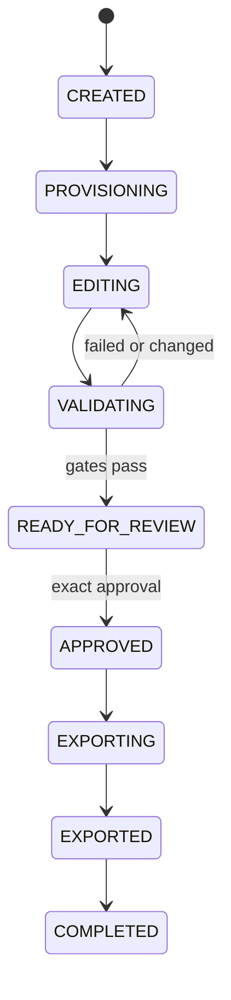

# ADR-003: Session state machine and invariants

- **Status:** accepted
- **Date:** 2026-07-27
- **Scope:** E3 V1 with reserved future apply states

## Context

E3 must make partial success, retry, cancellation, stale workers, validation
failure, approval invalidation, export, and later apply recoverable. Free-form
status strings and scattered updates are not sufficient. Existing project code
already demonstrates how application status and a SQLite constraint can drift.

## Decision

One pure domain module is the only source of valid states, commands,
transitions, event types, and failure codes. Database constraints and API
schemas are generated from or tested against the same definitions.

### Active V1 states

| State | Meaning |
|---|---|
| `CREATED` | durable identity and base SHA exist |
| `PROVISIONING` | mirror/workspace resources are being created |
| `EDITING` | deterministic read and mutation operations are allowed |
| `VALIDATING` | a frozen candidate is being checked |
| `READY_FOR_REVIEW` | patch and successful validation are frozen |
| `APPROVED` | a user approved exact frozen hashes |
| `EXPORTING` | the approved V1 patch package is being built |
| `EXPORTED` | the package and its hash are durable |
| `COMPLETED` | final event and cleanup/quarantine result are durable |

### Recovery and terminal states

- `RECOVERING`
- `FAILED`
- `CANCELLED`
- `STALE`
- `CONFLICTED`

### Reserved future states

- `APPLYING`
- `APPLIED`
- `FINAL_VERIFYING`
- `REVERTING`
- `REVERTED`

The reserved states are defined for data compatibility but cannot be entered
while productive apply is disabled.

## Main transitions

Common exceptional transitions:

- active non-apply states may enter `FAILED` on an unrecoverable error
- cancellable states enter `CANCELLED` only through an explicit command
- startup reconciliation may move an interrupted state to `RECOVERING`
- `RECOVERING` returns only to a proven safe state or a terminal state
- base divergence or a future apply/undo conflict enters `CONFLICTED`
- stale heartbeat classification enters `STALE`; it does not itself authorize
  cleanup

## Command and transition rules

Every state-changing command provides:

- session ID
- expected session version
- lease owner and fencing token where a resource is involved
- actor and request ID
- command-specific expected hashes

The transaction must:

1. load the session and verify ownership/authorization
2. compare expected version and fencing token
3. verify transition guard and invariant set
4. update state and increment version
5. append exactly one corresponding event
6. commit atomically

Duplicate request IDs return the original result. They do not append a second
event.

## Freeze and invalidation

Entering `READY_FOR_REVIEW` freezes:

- base commit
- ordered operation journal
- candidate file manifest
- forward and reverse patch
- validation manifest
- policy and validator profile versions

Any later mutation requires an explicit reopen transition to `EDITING` and
atomically clears:

- review-ready time
- validation success
- approval identity and time
- patch, validation, and export hashes

An approval cannot be updated in place. It is revoked and recreated.

## Failure semantics

- validation failure normally returns to `EDITING` with a durable result
- infrastructure failure returns to `EDITING` only when no candidate ambiguity
  exists; otherwise it enters `RECOVERING`
- timeout and cancellation kill the complete owned process group
- errors use stable codes; redacted messages are diagnostic metadata
- no error path silently changes the base, profile, operation, or scope

## Consequences

- transition logic can be exhaustively tested without filesystem or database
  access in Step 2
- optimistic versioning and fencing block stale writers
- append-only events provide a reconstructable semantic history
- new states require a deliberate schema and test update

## Rejected alternatives

- free-form text status
- API handlers updating session rows directly
- approval stored only in process memory
- stale time alone granting ownership
- successful validation remaining valid after a mutation

## Verification

- table-driven tests cover every state/command pair
- all invalid transitions leave state, version, and events unchanged
- duplicate request IDs are idempotent
- stale version and stale fencing token are rejected
- every mutation path invalidates freeze and approval
- fault injection between transaction steps cannot create state without event
