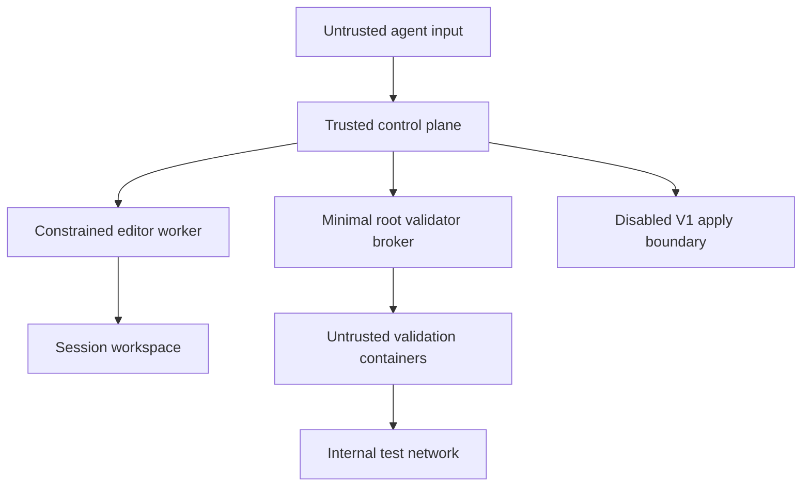

# E3 threat model

**Status:** accepted for E3 V1

**Reviewed baseline:** `4511411b8e60cc20be2ee5fdfad3a76f17e74a8e`

## Scope

This model covers session creation, workspace provisioning, deterministic file
operations, diff and artifact production, validation, review, approval,
export, cleanup, and startup recovery.

Productive apply is described as a future trust boundary but is disabled in
V1. Existing EchoLink chat, task, terminal, deployment, and production
Playwright paths remain separate systems and are not trusted as E3 sandboxes.

## Assets

- integrity and availability of `/root/echolink`
- production `.env`, databases, sessions, uploads, backups, and credentials
- correctness of the session state and audit history
- exact association of patch, validation, and user approval
- integrity of the dedicated Git mirror and workspace manifests
- host availability, disk, memory, CPU, process, port, and Docker capacity
- confidentiality of logs, screenshots, and validation artifacts

## Actors and assumptions

| Actor | Trust |
|---|---|
| authenticated user | may approve a shown artifact; input is still validated |
| model/agent | untrusted input producer |
| E3 control plane | trusted for authorization and state coordination |
| workspace manager | trusted for Git and lifecycle operations |
| editor worker | constrained; may contain defects and handles hostile input |
| validator broker | highly trusted, minimal, fixed-profile launcher |
| project code under validation | fully untrusted |
| production repository and data | protected assets, never validator inputs |
| external network/service | untrusted and unavailable by default |

The current EchoLink server and PM2 processes run as root. This fact increases
the control-plane impact but does not relax any worker or validation boundary.

## Trust boundaries

Boundary rules:

- all agent input crosses schema and authorization checks
- all paths are converted to internal workspace handles before worker use
- broker requests select a registered profile; they never contain a command
- validation runs against a frozen candidate, not the editing workspace
- the production repository, Docker socket, host network, and production
  environment are absent from validation containers

## Abuse cases and controls

| ID | Abuse case | Required control |
|---|---|---|
| A-01 | `../`, absolute path, NUL, or encoding trick escapes the workspace | strict relative path grammar, canonical containment, fail closed |
| A-02 | symlink or hardlink redirects a write | `lstat` each component, reject symlinks and multi-link mutation targets |
| A-03 | race swaps a checked path before write | exclusive workspace lease, no concurrent writer, same-directory temp and rename |
| A-04 | model asks validator to run a shell command | fixed profile registry, schema rejects command/executable fields |
| A-05 | lifecycle script or test steals production secrets | clean environment, synthetic data, no production mounts |
| A-06 | test reaches production server or Internet | internal isolated network, no hostnetwork, egress denied |
| A-07 | worker controls Docker through socket or group | no socket mount and no Docker group membership |
| A-08 | approval is replayed after patch change | approval binds all hashes and versions; mutation revokes it |
| A-09 | stale worker writes after lease takeover | fencing token checked on every state-changing action |
| A-10 | malicious manifest makes reaper delete arbitrary path | manager-owned manifest, canonical root check, quarantine on ambiguity |
| A-11 | build fills disk or emits huge logs | hard resource and artifact quotas, bounded streams, provisioning stop threshold |
| A-12 | container leaves processes or ports behind | process-group ownership, container labels, port leases, `finally` cleanup |
| A-13 | crash leaves partially written artifact or metadata | SQLite transaction, temp file, fsync, atomic rename, startup reconciliation |
| A-14 | Git mirror is used to push or inject credentials | no push URL or credentials, trusted manager only, full-SHA checkout |
| A-15 | validation edits candidate after review | validate separate frozen snapshot and verify manifest after run |
| A-16 | undo destroys later unrelated work | new revert session; never reset or overwrite conflicts |
| A-17 | logs or screenshots expose tokens | environment allowlist, redaction, URL sanitization, access control, retention |
| A-18 | compromised validator broker starts an arbitrary privileged container | minimal request schema, fixed immutable profile definitions, audit and negative tests |

## Invariant enforcement and negative-test matrix

| Invariant | Primary enforcement point | Required negative test |
|---|---|---|
| I-01 production is not writable | OS ownership plus absent production mount | worker and validator attempts to create a canary under `/root/echolink` fail |
| I-02 full base SHA | session constructor and DB constraint | short, missing, unknown, or moving refs are rejected |
| I-03 registered operations only | operation registry and schema | unknown operation and extra fields are rejected |
| I-04 no agent shell | validator request schema and spawn wrapper | `command`, metacharacters, and arbitrary executable are rejected |
| I-05 contained paths | path policy and worker filesystem adapter | traversal, absolute, NUL, backslash, symlink, and race corpus fails |
| I-06 forbidden targets | versioned path-policy table | `.git`, `.env`, `data`, backups, uploads, `node_modules`, and `dist` fail |
| I-07 clean validation env | broker profile environment builder | sentinel production variable is absent inside every profile |
| I-08 synthetic DB only | profile mount and fixture policy | production DB path is absent and connection attempt fails |
| I-09 no production port | port allocator and bind policy | request for port 3000 and already leased port fails |
| I-10 isolated UI target | internal network and origin allowlist | production origin, host gateway, and Internet probes fail |
| I-11 hash-bound approval | approval service and DB transaction | changed patch, manifest, base, policy, or profile invalidates approval |
| I-12 mutation revokes freeze | central transition function | every mutating operation from review/approval returns to editing |
| I-13 fenced concurrency | lease repository and manager APIs | stale owner cannot update, cleanup, validate, export, or apply |
| I-14 fail closed | error mapping at every boundary | missing profile, unsupported host feature, and timeout never fall back |
| I-15 no V1 production action | feature flags and absent capability wiring | export cannot invoke apply, deploy, push, or PM2 |
| I-16 bounded redacted logs | streaming log sink | oversized output truncates and seeded secrets never appear |
| I-17 durable completion | completion transaction and recovery | crash before artifact, cleanup, or event leaves session recoverable, not complete |

An implementation step is incomplete until its applicable negative tests exist
and fail for the deliberately unsafe fixture.

## Container baseline

Every validation container must use:

- immutable allowlisted image reference
- non-root UID/GID
- read-only root filesystem
- dropped Linux capabilities
- `no-new-privileges`
- seccomp plus an E3 AppArmor profile when available
- bounded CPU, memory, PIDs, files, output, and wall time
- controlled tmpfs and explicit mounts only
- no Docker socket, host PID namespace, host IPC, privileged mode, devices, or
  hostnetwork
- internal network only when a multi-container UI profile requires it

AppArmor is defense in depth. Missing or failed primary isolation never falls
back to AppArmor alone.

## Residual risks

- The existing EchoLink control plane runs as root and remains a high-impact
  trusted component.
- Rootful Docker means the validator broker is security critical.
- Kernel, Docker, seccomp, or AppArmor vulnerabilities are outside E3's
  application-level controls.
- Git patches are not a crash-atomic production release mechanism.
- Full prevention of resource exhaustion is impossible; quotas reduce impact.

These risks are accepted only for a V1 that cannot apply to production. A
productive apply phase requires a separate operational security review.

## Security release gate

Before E3 executes project code, the test suite must demonstrate:

1. worker denial against production paths and secrets
2. broker denial of arbitrary commands, mounts, images, networks, and env
3. network denial to production, host gateway, and public Internet
4. fencing under concurrent claim and stale-worker scenarios
5. cleanup after timeout, crash, process tree, and occupied port
6. artifact and approval tamper detection
7. disk-pressure behavior without automatic Docker pruning
